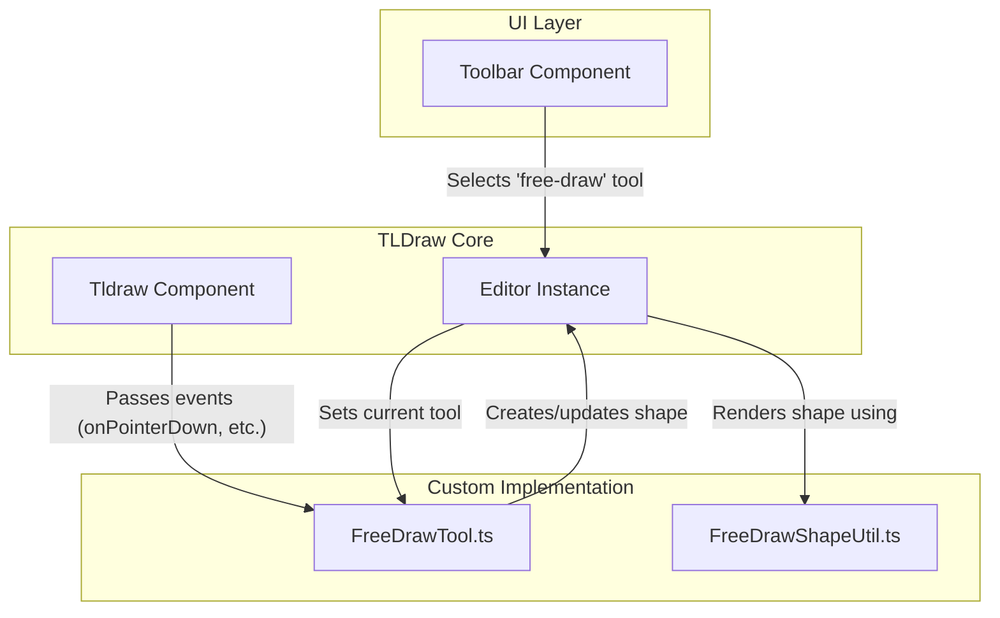

# Hybrid Slide Canvas: AI-Powered Slide Creator

Hybrid Slide Canvas is a lightweight React 19 + Vite application that fuses a tldraw-based canvas with an AI chat assistant for "text-to-diagram" creation. Users can seamlessly blend direct manipulation with natural language commands to build presentations.

## User Journey

- **Create a New Presentation**: Start with an empty canvas or choose from slide templates.
- **Add Content Through Natural Language**: Use the AI chat to add shapes, text, and diagrams.
- **Refine with Direct Manipulation**: Adjust elements by dragging, resizing, or using property panels.
- **Organize Your Slides**: Create multiple slides and reorder them via the thumbnail bar.
- **Selectively Undo/Redo**: Use the toolbar to undo actions from specific sources (e.g., undo the last AI action without affecting your manual changes).
- **Present or Export**: Share your finished presentation.

## Project Status (July 4, 2025)

- **Architecture**: Stable three-panel layout (`LeftSidebar`, `CanvasRegion`, `RightSidebar`) with context-based state propagation.
- **State Management**: Zustand with Immer for predictable state, persisted to IndexedDB via a custom `dexieStorage` middleware.
- **Undo/Redo**: A robust, custom multi-origin undo/redo system (`HistoryManager`) is fully implemented and tested, separating `user` and `ai` action histories.
- **Free-Draw Pen**: A free-draw pen tool is now available in the toolbar, allowing for freehand sketching on the canvas.
- **AI Integration**: The AI chat panel is fully functional, using OpenAI's API to translate natural language into tldraw shapes.
- **Testing**: The test suite is stable. A canonical, documented pattern for testing Zustand-connected components is enforced across the codebase.
- **Dependencies**: All Y.js-related code has been removed. The project has a clean, minimal dependency tree.
- **Next Up**: Begin MVP Phase 3: Export functionality (PNG/PDF).

## Changelog

### 2025-07-04 — MVP Phase 2: Free-Draw Pen Implementation

- **Added Free-Draw Tool**: Implemented a complete free-draw pen tool, including a custom shape (`FreeDrawShapeUtil`), a stateful tool (`FreeDrawTool`), and a toolbar button for activation.
- **Updated Toolbar**: The main toolbar now includes a "Pen" button that activates the free-draw tool and provides visual feedback when active.
- **Integrated with Canvas**: The new shape and tool are correctly registered with the `tldraw` editor instance in `CanvasSlide.tsx`.

### 2025-07-04 — Toolbar Test Suite Refactor & Documentation Update

- **Fixed `Toolbar` Tests**: Correctly implemented the Zustand store reset pattern in `Toolbar.test.tsx`, resolving all test failures related to store actions being undefined. The test suite for the `Toolbar` component is now stable and accurate.
- **Updated README**: Updated the project structure and file responsibilities in the `README.md` to provide a comprehensive and up-to-date reference for developers.

### 2025-07-03 — Test Suite Stabilization

- **Fixed `ConversationProvider`**: Resolved all outstanding type errors and refactored tests to use modern `vi.mock` declarations.

## 📁 Project Structure

```text
hybrid-slide-canvas/
├── .env.template
├── .eslintrc.cjs
├── .gitignore
├── .prettierrc
├── README.md
├── index.html
├── package.json
├── pnpm-lock.yaml
├── postcss.config.js
├── public/
├── src/
│   ├── App.css
│   ├── App.tsx
│   ├── __tests__/
│   │   ├── App.test.tsx
│   │   ├── FreeDrawIntegration.test.ts
│   │   ├── components/
│   │   ├── smoke.test.tsx
│   │   └── test-utils/
│   ├── assets/
│   ├── components/
│   │   ├── CanvasRegion.tsx
│   │   ├── CanvasSlide.tsx
│   │   ├── Chat/
│   │   ├── ErrorBoundary.tsx
│   │   ├── LeftSidebar.tsx
│   │   ├── LibraryPanel.tsx
│   │   ├── RightSidebar.tsx
│   │   ├── SlideRail.tsx
│   │   ├── Toolbar.tsx
│   │   └── TopNav.tsx
│   ├── context/
│   │   └── EditorContext.tsx
│   ├── hooks/
│   │   ├── useAI.ts
│   │   └── useSlides.ts
│   ├── lib/
│   │   ├── features.ts
│   │   ├── history/
│   │   ├── middleware/
│   │   ├── openaiClient.ts
│   │   ├── shapeLibraries/
│   │   ├── shapes/
│   │   ├── storage/
│   │   ├── test/
│   │   ├── tldraw/
│   │   ├── tldrawHelpers.ts
│   │   ├── tools/
│   │   ├── types.ts
│   │   └── utils/
│   ├── main.tsx
│   ├── setupTests.ts
│   ├── state/
│   │   ├── slidesStore.ts
│   │   └── uiStore.ts
│   ├── styles/
│   └── types/
├── tailwind.config.js
├── tsconfig.json
├── tsconfig.node.json
└── vitest.config.ts
```

## Key File Responsibilities

- **`src/App.tsx`**: The root component. Assembles the main three-panel UI layout and provides global contexts.
- **`src/components/CanvasSlide.tsx`**: Renders a single `tldraw` instance. It is responsible for registering all custom shapes and tools (like the `FreeDrawShapeUtil` and `FreeDrawTool`) with the editor.
- **`src/components/Toolbar.tsx`**: The main application toolbar. Provides global controls like multi-origin undo/redo and tool selection buttons, including the new free-draw pen.
- **`src/lib/shapes/FreeDrawShapeUtil.ts`**: The `ShapeUtil` for the free-draw shape. It defines the shape's geometry, rendering logic (including the critical `toSvg` method for exports), and user interactions.
- **`src/lib/tools/FreeDrawTool.ts`**: The `StateNode` (state machine) for the free-draw tool. It manages the tool's state (e.g., `idle`, `pointing`, `drawing`) and handles user input events to create and update free-draw shapes.
- **`src/lib/history/HistoryManager.ts`**: The core class for the multi-origin undo/redo system. It listens to `tldraw` store changes, determines the action's origin, and uses the `useHistoryStore` to manage the undo/redo stacks.
- **`src/lib/history/useHistoryStore.ts`**: A Zustand store that holds the state for the history system, including the undo and redo stacks for each origin (`user`, `ai`).
- **`src/lib/history/useHistoryManager.ts`**: A React hook that creates and memoizes an instance of the `HistoryManager`, connecting it to the active `tldraw` editor instance.

## Architecture & Patterns

### Multi-Origin Undo/Redo System

To provide granular control over the application's history, we've implemented a custom multi-origin undo/redo system. This allows users to selectively undo actions based on their source (e.g., "undo last AI action" without affecting manual edits).

**Logic Flow:**

```mermaid
graph TD
    subgraph UI Layer
        A[Toolbar Component]
    end

    subgraph Hooks
        B(useHistoryManager)
    end

    subgraph Core Logic
        C{HistoryManager Class}
        D[TLDraw Editor Store]
        E[useHistoryStore (Zustand)]
    end

    A -- "Undo/Redo (user, ai)" --> B
    B -- "Manages instance" --> C
    C -- "Listens for changes" --> D
    D -- "Notifies with new shapes" --> C
    C -- "Tags origin & pushes to stack" --> E
    B -- "Selects canUndo/canRedo" --> E
    A -- "Receives reactive state" --> B
```

### Free-Draw Pen

The free-draw pen allows users to create freehand drawings on the canvas. It uses the `perfect-freehand` library for smooth, pressure-sensitive strokes.

**Logic Flow:**



### Zustand Store Testing Pattern

We have adopted a canonical pattern for testing components that consume Zustand stores to ensure reliability and prevent common pitfalls.

- **Use the Real Store**: Tests import and use the actual store module, not a mock. This ensures the test runs against the identical middleware chain (`immer`, `dexieStorage`).
- **Reset State in `beforeEach`**: In the `beforeEach` block, the store is reset to a clean initial state using `store.setState(initialState, true)`. The `true` argument forces a complete state replacement, preventing state leakage between tests.
- **Mock Only External Dependencies**: Only external modules (like API clients or other hooks like `useHistoryManager`) are mocked. The store itself remains real.
- **Wrap State Updates in `act()`**: Direct store mutations within tests are wrapped in `act()` from `@testing-g/react` to ensure component re-renders are processed before assertions.

## 🚀 Quick Start

```bash
# Clone the repository
git clone https://github.com/ALehav1/hybrid-slide-canvas.git
cd hybrid-slide-canvas

# Install dependencies (pnpm is recommended)
pnpm install

# Set up environment variables
cp .env.template .env
# Add your OpenAI API key to the .env file
echo "VITE_OPENAI_API_KEY=sk-..." >> .env

# Run the development server
pnpm dev
```

Open [http://localhost:5173](http://localhost:5173) in your browser.

## 🤝 Contributing

- Fork the repository.
- Create a new feature branch: `git checkout -b feat/your-amazing-feature`.
- Commit your changes, ensuring all tests and lint checks pass.
- Open a Pull Request with a clear description of your changes.

## 📄 License

[MIT](LICENSE)
