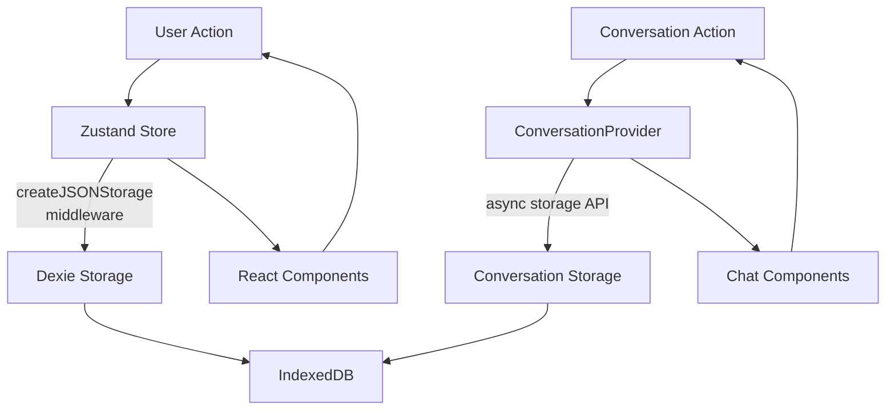

# Hybrid Slide Canvas: AI-Powered Slide Creator

Hybrid Slide Canvas is a lightweight React 19 + Vite application that fuses **TLDraw 3** for drawing, **Rough.js** for a hand-drawn aesthetic, and an AI chat assistant for "text-to-diagram" creation.
Type **"add a blue rectangle"** and the shape appears—no manual toolbar clicks.

## User Journey

1. **Create a New Presentation**: Start with an empty canvas or choose from slide templates
2. **Add Content Through Natural Language**: Use the AI chat to add shapes, text, and diagrams
3. **Refine with Direct Manipulation**: Adjust elements by dragging, resizing, or using property panels
4. **Organize Your Slides**: Create multiple slides, reorder them via the thumbnail bar
5. **Apply Consistent Styling**: Choose from themes or customize the look and feel
6. **Present or Export**: Share your finished presentation

---

## Project Status (June 30, 2025)

| Area | State |
|:---|:---|
| Codebase | **Clean & Tested** — >500 dead files removed, consistent paths, robust test coverage. |
| Core libs | **React 19**, **@tldraw/tldraw 3.13**, **Zustand**, **Rough.js** |
| Performance | No more render loop; slide switch < 2 ms; ChatPanel optimized. |
| AI bridge | Chat → JSON → canvas shape **working** and stable. |
| Next up | Sketch free-draw, export to PDF, template library |

---

## AI Command Examples

```text
# Basic Shapes
"Add a blue rectangle"
"Create a rough green ellipse 150×100 labeled Budget"
"Draw a yellow star in the center"

# Complex Elements
"Create a flowchart with Start, Process, Decision, and End nodes"
"Add three blue circles in a row labeled A, B, and C"
"Draw a rough-style org chart with CEO at top"

# Formatting
"Add a text box with 'Quarterly Goals' in bold"
"Create a 2x3 table with headers Sales, Marketing, and Operations"
"Draw a border around the entire slide"
```

## Key Features

### AI Integration

- **AI Shape Commands** — e.g.  
  `add a rough green ellipse 150×100 labelled Budget`
- **Context-Aware AI** — The AI remembers slide context and previous conversations
- **Natural Language Processing** — Create, modify, and position shapes using everyday language
- **AI Assistance** — Get help with design suggestions and content organization

### Canvas & Drawing

- **Sketch-Style Rendering** — Rough.js strokes + TLDraw `dash:"draw"`
- **Shape Library Sidebar** — Pre-built flowchart, diagram, and org-chart nodes
- **Rich Text Support** — Add and format text with multiple styling options
- **Smart Object Alignment** — Intelligent snapping and alignment guides

### Presentation Management

- **Multi-Slide Decks** — Create, delete, and reorder slides via the thumbnail rail
- **Per-Slide Chat Memory** — Each slide keeps its own chat history, persisted in IndexedDB via Dexie.js
- **Slide Thumbnails** — Visual navigation through your presentation
- **Slide Templates** — Start with pre-designed layouts for common use cases

### User Interface

- **Modern, Responsive UI** — Sidebar (library + chat), center canvas, thumbnail bar
- **Keyboard Shortcuts** — Speed up common actions with intuitive shortcuts
- **Contextual Menus** — Right-click access to relevant tools and options
- **Adaptive Layout** — Works on desktop and tablets with responsive design

---

## Performance Metrics

| Metric | Performance |
|:---|:---|
| Slide switching | < 2ms |
| Shape creation | < 50ms |
| AI response time | 1-3s (dependent on OpenAI) |
| Canvas render | 60 FPS sustained |
| Initial load | < 1.5s to interactive |
| Memory usage | < 80MB baseline |

## Known Limitations

- Maximum 100 shapes per slide for optimal performance
- Canvas size limited to 4096x4096 pixels
- AI commands work best with simple, direct language
- Limited export formats (currently PNG only, PDF coming in Q3 2025)
- No offline mode for AI features (requires OpenAI API access)

## Architecture

The application's state is managed by two primary systems:

1. **`Zustand` with Immer and IndexedDB Persistence**: Handles global state with robust, transactional storage capabilities:
   - **`slidesStore.ts`**: Core slide state using Immer for immutable updates and Dexie/IndexedDB persistence for large data, factory functions for consistency
   - **`slidesSelectors.ts`**: Comprehensive selector system with:
     - Direct store integration hooks for simplified component use
     - Memoized selectors for performance optimization
     - Type guards and safety helpers to prevent runtime errors
     - Composed selectors for complex data transformations
     - Conversation and metadata-specific selectors
   - **`dexieStorage.ts`**: Dexie database implementation for robust, transactional storage
   - **`indexedDbMiddleware.ts`**: Zustand middleware for transparent persistence
2. **[ConversationProvider.tsx](cci:7://file:///Users/arilehavi/hybrid-slide-canvas/src/components/ConversationProvider.tsx:0:0-0:0)**: A React context provider that serves as the single source of truth for all chat-related functionality. It manages UI state (input values, expanded panels), loading/error states, and the conversation history for every slide. This centralized approach prevents component-level state conflicts and ensures a predictable data flow.

All components that need access to chat functionality, like `ChatPanel`, consume the `useConversationContext` hook.

### Persistence Architecture

Hybrid Slide Canvas uses a well-structured state management approach with middleware to ensure data persistence, type safety, and performance:

#### Data Storage Strategy

- **Zustand with Dexie persistence**: All slide data is stored in IndexedDB via Dexie.js to support larger data volumes and better performance
- **Dexie-based conversation storage**: Conversation data uses the same IndexedDB database with a dedicated API
- **Browser compatibility**: Works in all modern browsers with IndexedDB support
- **Migration helpers**: Handles data migration between schema versions
  - Atomic updates for data consistency
  - Configurable persistence settings per store

#### Data Flow



#### Benefits

- **Improved Performance**: IndexedDB offers better performance for larger datasets
- **More Storage Space**: Overcomes browser storage limits with IndexedDB
- **Background Syncing**: Supports background saving without blocking UI
- **Structured Data**: Rich schema support with IndexedDB and Dexie.js
- **Transaction Support**: ACID transactions for data reliability
- **Unified Storage Strategy**: Both slides and conversations use IndexedDB

#### Migration Process

The application includes migration helpers that automatically:

1. Check for schema version mismatches during application startup
2. If needed, automatically migrate data to the new schema version
3. Preserve data integrity throughout migration process
4. Track migration completion to avoid duplicate migrations

#### Testing Strategy

- Uses `fake-indexeddb` to simulate browser IndexedDB in Vitest test environment
- Centralized mocks in `src/__tests__/test-utils/mocks/`
- Isolation testing with Vitest spies and mocks
- Integration testing with MSW for network simulation

```ascii
┌─────────────┐         ┌──────────────┐         ┌───────────────┐
│  Zustand    │         │    Dexie     │         │   IndexedDB   │
│   Store     │◄-------►│ Storage Adapter │◄-------►│   Database    │
└─────────────┘         └──────────────┘         └───────────────┘
       ▲                                                  ▲
       │                                                  │
       │                                                  │
       │                                                  │
       │                                                  ▼
       │                       ┌────────────────────────────┐
       └───────────────────────┤        Application         │
                               └────────────────────────────┘
```

- **Zustand Store**: Maintains application state and triggers persistence operations
- **Dexie Storage Adapter**: Handles serialization and transaction management
- **IndexedDB Database**: Native browser storage with structured query capabilities
- **Transaction Management**: Ensures data integrity with atomic operations
- **Persistent Storage**: Survives page reloads and browser restarts

### State Management Architecture

The application uses a multi-layer middleware approach with Zustand:

1. **Immer Middleware**: First in the chain, providing immutable state updates with structural sharing
   - Enables intuitive state mutation syntax while preserving immutability (`draft.slides.push(newSlide)` instead of `{...state, slides: [...state.slides, newSlide]}`)
   - Improves developer experience with TypeScript type safety
   - Prevents accidental mutations through proxies
   - Optimizes performance with structural sharing (only modified objects are new references)
   - Reduces boilerplate code and improves readability
   - Optimizes performance by only updating changed parts of the state

2. **Persistence Middleware**: Next in the chain, handles automatic state serialization to storage
   - Persists state to IndexedDB via Dexie for resilience and large data storage
   - Handles serialization/deserialization of complex objects including dates
   - Manages state hydration on app initialization
   - Provides version migration support

3. **Dev-only deepFreeze Utility**: Applied outside the middleware chain in development mode only
   - Bulletproof implementation with `deepFreeze(state)` that handles circular references and symbols
   - Throws errors when code attempts to mutate frozen state
   - Helps catch mutation bugs during development
   - Automatically disabled in production for performance
   - Provides detailed error logs pointing to mutation attempts
   - Located in `src/lib/utils/deepFreeze.ts`

```typescript
// State middleware chain example (simplified)
const useSlidesStore = create<SlidesState>(
  immer(
    persist(
      createSlidesStore,
      { storage: createDexieStorage('slidesDb') }
    )
  )
)

// Dev-only deep freeze is applied outside the middleware chain
if (import.meta.env.DEV) {
  deepFreeze(state)
};
```

### TLDraw Shape ID Strategy

A critical architecture component is our unique shape ID generation strategy (implemented in `src/lib/utils/clientId.ts`):

1. **Client Instance Prefixing**: Each browser instance gets a unique client ID
   - Format: `c_{nanoid(4)}` (e.g., `c_a1b2`)
   - Persists across page reloads for consistency
   - Implemented via `createUniqueShapeId()` function

2. **Shape ID Generation**: All TLDraw shapes use prefixed IDs
   - Uses `createUniqueShapeId()` utility from `clientId.ts`
   - Format: `{clientId}-{nanoid(8)}` (e.g., `cid-a1b2c3-x7y8z9w0`)
   - Ensures no collisions across tabs, devices, or collaborative sessions
   - Type-safe: IDs are properly cast to TLDraw's `TLShapeId` type

### Testing with IndexedDB

1. **Mock Implementation**: Uses `fake-indexeddb` for tests
   - Automatically configured in `setupTests.ts`
   - Provides in-memory IndexedDB implementation
   - No configuration needed for individual tests

2. **Testing Patterns**:
   - Storage adapter tests verify read/write operations
   - Store tests confirm persistence behavior
   - Migration tests validate data evolution
   - All mocks centralized in `src/__tests__/test-utils/mocks/`

### Architecture Diagram

#### Chat Flow

```ascii
┌─────────────┐     ┌──────────────────┐     ┌─────────────┐
│   ChatPanel │────▶│ConversationProvider│────▶│ OpenAI API  │
└─────────────┘     └──────────────────┘     └─────────────┘
                             │
                             ▼
┌─────────────┐     ┌──────────────────┐     ┌─────────────┐
│ CanvasSlide │◀────│   aiActions.ts   │◀────│ AI Response │
└─────────────┘     └──────────────────┘     └─────────────┘
```

#### Processing Flow

1. **User Input** → Chat message entered in ChatPanel
2. **AI Processing** → The conversation provider sends the message to the OpenAI API
3. **Response Parsing** → The AI response is parsed through aiActions.ts to extract structured commands
4. **Canvas Updating** → Valid commands are executed via tldrawHelpers.ts to create/modify shapes
5. **State Persistence** → Changes are saved to the Zustand store and persisted to IndexedDB
1. **User Interaction** → When a user types in the chat panel, the input is captured by `ChatPanel` and passed to [ConversationProvider](cci:1://file:///Users/arilehavi/hybrid-slide-canvas/src/components/ConversationProvider.tsx:22:0-364:2)


---

## 🚀 Quick Start

```bash
# clone
git clone [https://github.com/ALehav1/hybrid-slide-canvas.git](https://github.com/ALehav1/hybrid-slide-canvas.git)
cd hybrid-slide-canvas

# install (pnpm recommended)
pnpm install          # or npm i / yarn

# copy env and add OpenAI key (optional for offline usage)
cp env.template .env
echo "VITE_OPENAI_API_KEY=sk-..." >> .env

# run dev server
pnpm dev
# open http://localhost:5173
📁 Project Structure
```text
src/
├─ components/
│  ├─ ConversationProvider.tsx   Centralized chat state and logic
│  ├─ CanvasSlide.tsx          TLDraw wrapper with sketch rendering
│  ├─ SlideManager.tsx         Slide navigation and management
│  ├─ ErrorBoundary.tsx        Global error handling
│  ├─ LibraryPanel.tsx         Shape library sidebar
│  └─ Chat/
│     ├─ ChatPanel.tsx         Chat UI and message handling
│     ├─ ChatInterface.tsx     Message display and input components
│     ├─ MessageList.tsx       Renders conversation history
│     └─ aiActions.ts          Zod schema & handlers
├─ hooks/
│  ├─ useAppHandlers.ts        App-level event handlers
│  ├─ useConversationContext.ts  Chat context consumer hook
│  └─ useSlideOrchestration.ts   Slide management and orchestration
├─ lib/
│  ├─ tldrawHelpers.ts         createSketchShape(), group utilities
│  ├─ theme.ts                 UI and canvas theme settings
│  ├─ openaiClient.ts          OpenAI API integration
│  ├─ shapeLibraries/
│  │  ├─ basic.ts              Basic shapes (rectangles, circles, etc.)
│  │  ├─ flowchart.ts          Flowchart specific shapes
│  │  └─ diagrams.ts           Diagram components
│  ├─ storage/
│  │  └─ dexieStorage.ts       Zustand <-> Dexie adapter
│  └─ utils/
│     ├─ clientId.ts           createUniqueShapeId()
│     ├─ deepFreeze.ts         dev-only immutability guard
│     └─ logging.ts            Structured logging utilities
├─ state/
│  ├─ slidesStore.ts           Production store (immer + persist)
│  ├─ slidesSelectors.ts       Memoized selectors for slides data
│  └─ enhancedSlidesStore.ts   Experimental features
├─ types/
│  └─ app.ts                   Application-wide type definitions
├─ __tests__/
│  └─ test-utils/
│     └─ mocks/                Centralized test mocks
├─ styles/
│  └─ App.css                 Global styles and CSS variables
├─ App.tsx                    Application layout and composition
└─ main.tsx                   React entry point
## Path Aliases

The project uses TypeScript path aliases to simplify imports:

- `@/types` → `src/types/` - Application-wide type definitions
- `@/lib` → `src/lib/` - Utilities, storage, and helper modules
- `@/components` → `src/components/` - UI components
- `@/hooks` → `src/hooks/` - React hooks
- `@/state` → `src/state/` - State management
- `@/styles` → `src/styles/` - Global styles and CSS variables

## Key File Responsibilities

- **ConversationProvider.tsx** - Central chat state manager that handles message processing, AI interactions, and slide-specific conversation history
- **CanvasSlide.tsx** - Manages the TLDraw canvas instance with sketch-style rendering and shape creation
- **slidesStore.ts** - Production Zustand store managing slide state, navigation, and persistence
- **enhancedSlidesStore.ts** - Experimental store with additional features and optimizations
- **tldrawHelpers.ts** - Utilities for creating sketch-style shapes and managing TLDraw operations
- **aiActions.ts** - Zod schema that validates and processes AI commands for canvas manipulation
- **dexieStorage.ts** - Zustand storage adapter for Dexie/IndexedDB persistence
- **clientId.ts** - Unique client ID generation for TLDraw shape IDs
- **deepFreeze.ts** - Bulletproof immutability guard for development
- **App.tsx** - Main application component that composes the UI layout and wires major components together
## 🛠️ Development Scripts

| Script | Action |
| ------ | ------ |
| pnpm dev | start Vite dev server |
| pnpm build | production build |
| pnpm preview | preview production build locally |
| pnpm test | run Vitest tests |
| pnpm lint | ESLint code check |
| pnpm format | Prettier auto-format |
## 🎯 Development Principles

- **Single Responsibility**: Each component has one clear purpose
- **Predictable State**: All state changes flow through defined channels
- **Test-Driven**: Features are built with tests first
- **Performance First**: Every feature considers render impact
- **Progressive Enhancement**: Core features work without AI, enhanced with it
- **Developer Experience**: Clear APIs, consistent patterns, helpful docs

## Testing Strategy

Our testing strategy is multi-layered to ensure code quality and stability:

### Testing Philosophy

1. **Core Functionality Tests**
   - Component rendering and lifecycle
   - User interactions with critical UI elements
   - Data flow between components
   - Error handling for common failure modes
   - State management verification

2. **Data Management Tests**
   - API integration with OpenAI
   - Data transformation (AI responses → canvas shapes)
   - State updates in Zustand store
   - IndexedDB persistence via Dexie adapter

3. **Edge Cases**
   - Error states and recovery
   - Loading states with proper UI feedback
   - Empty states (new slides, no history)
   - Boundary conditions in shape creation

4. **Performance**
   - Render optimization
   - Memory usage
   - Network efficiency
   - State update performance

### Testing Categories

1. **Unit Tests**: Core utilities, hooks (e.g., `ConversationProvider`, `openaiClient`, `slidesStore`) are tested in isolation to verify their core logic.

2. **Component Tests**: React components are tested using `@testing-library/react` to simulate user interactions and assert that the UI behaves as expected.

3. **Integration Tests**: Key user flows, like submitting a chat message that results in a shape being drawn, are tested to ensure different parts of the application work together correctly.

### Mock Organization

- Centralize ALL test mocks in `src/__tests__/test-utils/mocks/`
- Export all mocks through `index.ts` files 
- Separate by type (ui.tsx, api.ts, etc.)
- Use TypeScript for type safety
- Prefer type-safe mock factories over raw objects
- Re-use mocks across test files when possible
- Isolate API response mocks in dedicated files
- Use MSW for API mocking when testing components
- Typed with TypeScript for type safety

All tests are run via Vitest. To execute the full suite:

```bash
pnpm test
```

For development with visual test UI:

```bash
pnpm test:ui
```

## Recent Changes

### 2025-06-30 — State Management & Type-Safety Improvements

- **Immer**: Added Immer middleware for intuitive state mutations with immutable updates
- **Type Safety**: Enhanced TypeScript typings throughout the state management layer
  - Properly typed TLShapeId for strong type-checking and collision prevention
  - Fixed TypeScript errors in editor.select() and editor.deleteShapes() methods
  - Ensured consistent type usage between store and UI components
- **Decoupling**: Separated store creation from persistence for better maintainability
- **Migration**: Fully migrated from Jest to Vitest for better Vite integration
- **Coverage**: Added coverage reporting and improved test organization
- **Mock System**: Centralized mock architecture for consistent testing
  - All mocks consolidated to src/**tests**/test-utils/mocks/
  - Enhanced typings for mocks to catch errors early

### 2025-06-29 — ChatPanel Stability & UX Refactor

- **Stability**: Guarded against premature editor access to prevent race condition crashes
- **Performance**: Switched to a useSlidesStore selector to prevent unnecessary re-renders
- **UX**: Implemented auto-scrolling for the message list and ensured errors are cleared on subsequent interactions
- **Scalability**: Refactored AI action handling to a lookup table to simplify adding new commands

### 2025-06-29 — Major Cleanup & Refactor
- **Removed** legacy hooks, services, tests (> 500 files)
- **Fixed** infinite render loop, undefined imports, and duplicate variables
- **Upgraded** to React 19 + TLDraw 3.13 + Zustand store
- **Added** the core AI-to-shape bridge and a starter shape library

## 🗺️ Roadmap
Q3 2025
- Free-draw pen via Rough.js - Add natural sketch-style freehand drawing capability
- Export slides to PDF / PNG - Enable presentation export for sharing and printing
- Enhanced AI shape generation - Support more complex diagrams and layouts

Q4 2025
- Custom theme presets - Add Moody's palette, dark mode, and custom branding options
- Slide transitions and animations - Add animated transitions between slides
- Performance optimizations - Canvas rendering and state management improvements

Q1 2026
- Multi-user collaboration - Real-time editing via Yjs + Liveblocks
- Version history and branching - Track changes and explore alternative designs
- Template marketplace - Share and discover professional slide templates and shape libraries

Q2 2026
- AI presentation coaching - Feedback on slide design and content
- Advanced export options - Interactive web presentations and video export
- Enterprise integration - SSO, team management, and collaboration features

## 🤝 Contributing

1. Fork repository
2. `git checkout -b feat/your-feature`
3. Commit + test + lint
4. Open a PR — please include screenshots / test cases

### Getting Started for Contributors

#### Adding a New AI Command

1. Open `src/components/Chat/aiActions.ts`
2. Add your command to the `AiActionSchema` Zod schema:

```typescript
const AiActionSchema = z.object({
  action: z.enum(['createShape', 'addText', 'yourNewCommand']),
  // Add specific params for your command
});
```

3. Implement the command handler in `handleAiAction` function
4. Add tests in `aiActions.test.ts`

#### Creating a New Shape Type

1. Add shape definition to the appropriate library in `src/lib/shapeLibraries/`
2. Create the shape creator function:

```typescript
export function createCustomShape(editor: Editor, props: CustomShapeProps) {
  return editor.createShapes([
    {
      id: createShapeId(),
      type: 'custom',
      props: { ... },
      // Apply Rough.js styling
      style: { ...roughStyle },
    }
  ]);
}
```

3. Add to the shape factory in `tldrawHelpers.ts`
4. Create tests in `yourShape.test.ts`

#### Adding a Slide Template

1. Define template in `src/lib/templates/`
2. Create preview thumbnail
3. Add to template selector in `SlideManager.tsx`
4. Register in `slidesStore.ts` template actions
📄 License
MIT

